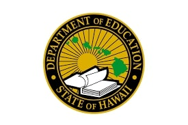

  

In my junior year of high school, I was selected to become an academy ambassador for the Academy of Technology and Design. Being an academy ambassador meant being able to know information about every pathway at the school. At Pearl City High School, there are three pathways: Culinary Art Health Science and Leadership (CAHSL), International Business and Design (IBAD), and Technology and Design (TAD). My responsibility was to present information and the accomplishments of each academy and their pathways. For example, the Health Science pathway of the CAHSL academy is known for collaborating with the nursing program at Kapiolani Community College to get high school students CPR certified. Knowing this information, we were expected to present this information, and more to prospective students and staff members from other high schools and the HIDOE.

My high school held an event and invited staff members mainly from the HIDOE, including the supervisor, to showcase the Culinary pathway of the CAHSL academy. Students cooked for a buffet style meal and served the food to everyone at the event (The food was really good btw). The academy ambassadors were also in attendance to talk to the people from the DOE to, hopefully, persuade them to support all the programs at Pearl City. 
