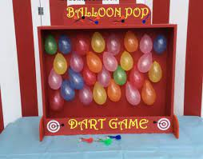

The Momilani Family Fun Fair is an annual event at Momilani Elementary School for their students to enjoy after an entire school year. Since Pearl City High School is right next door, students in the band program would go and help run the various games and food stands set up all over the cafeteria area. Since I was assigned to run the games, we were tasked to help the students win the game without making it obvious, which was easier said than done... After the kids finish playing the game, we were tasked to stamp their stamp card. With those stamp cards, the kids could redeem an entry in the raffle for the grand prize. These prizes comprised of toys, candy (probably a bad idea), and sometimes V-Bucks cards for Fortnite.

Running the games quickly became stressful once the doors to the cafeteria opened. The kids would run up to the first game they saw, but once there was a long line they would go to the next game they saw open. If you were near the entrance, it was over for you. The lines would never end since kids want to get as much stamps as they can. Luckily, after the first half an hour, the lines would slow down as the kids would start to gather around the food booths for dinner with their parents (again, there was really good food). However, the games would start to stack up right before the raffle closes, so kids would once again run to the first game they saw to get their stamps. Even though it's kind of stressful, it was fun operating the games for the kids to enjoy.
 
